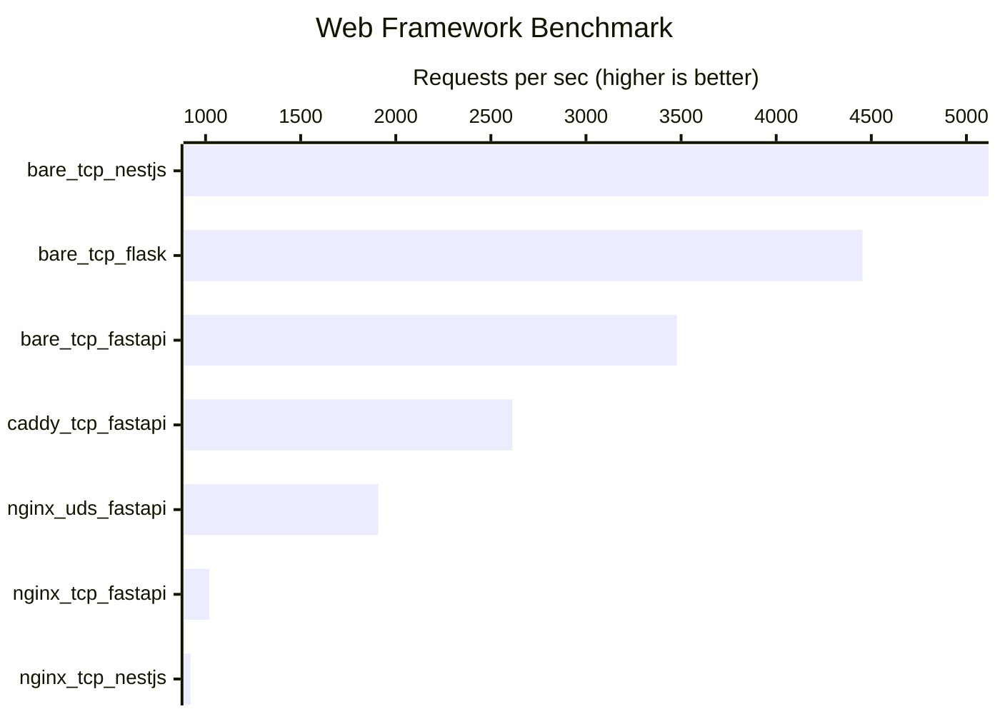

# Zenn Web Framework Comparison

A comprehensive benchmark comparison project that evaluates FastAPI performance across different proxy configurations and deployment setups. This project measures how various reverse proxy configurations affect web application performance.

## 📊 Latest Benchmark Results


## 🎯 Project Overview

This project compares the performance of FastAPI web applications under four different configurations:

1. **Bare TCP FastAPI** (3,494 req/s) - Direct connection to FastAPI without any reverse proxy
2. **Nginx + Unix Domain Socket + FastAPI** (1,768 req/s) - Nginx reverse proxy using Unix domain sockets
3. **Caddy + TCP + FastAPI** (1,589 req/s) - Caddy reverse proxy with TCP connections
4. **Nginx + TCP + FastAPI** (1,291 req/s) - Nginx reverse proxy with TCP connections

## 🛠️ Technology Stack

- **Web Framework**: FastAPI (Python 3.10+)
- **Reverse Proxies**: Nginx, Caddy
- **Load Testing**: Locust
- **Containerization**: Docker & Docker Compose
- **Task Automation**: Task (taskfile.yml)
- **Infrastructure**: AWS CDK (TypeScript)
- **Dependency Management**: Rye
- **Data Processing**: Pandas, Pydantic

## 🚀 Quick Start

### Prerequisites

- Docker and Docker Compose
- Python 3.10+
- Rye (for Python dependency management)
- Task (task runner)

### Installation

1. Clone the repository:
```bash
git clone https://github.com/gsy0911/zenn-web-framework-comparison.git
cd zenn-web-framework-comparison
```

2. Install Python dependencies:
```bash
rye sync
```

3. Generate SSL certificates (required for HTTPS testing):
```bash
# Create ssl directory
mkdir -p ssl

# Generate self-signed certificates for localhost
openssl req -x509 -newkey rsa:4096 -keyout ssl/localhost-key.pem -out ssl/localhost.pem -days 365 -nodes -subj "/CN=localhost"
```

4. Create reports directory:
```bash
mkdir -p reports
```

5. Start the services:
```bash
docker-compose up -d
```

### Running Benchmarks

#### Run Individual Benchmarks

```bash
# Test bare FastAPI (no proxy)
task bare-tcp-fastapi

# Test Nginx with Unix Domain Socket
task nginx-uds-fastapi

# Test Nginx with TCP
task nginx-tcp-fastapi

# Test Caddy with TCP
task caddy-tcp-fastapi
```

#### Run All Benchmarks

```bash
task benchmark-all
```

This will run all benchmarks sequentially and generate a summary chart.

## 🌐 Service Endpoints

Once the services are running, you can access:

- **Bare FastAPI**: `http://localhost:8080/fastapi-tcp/v1/user`
- **Nginx Proxy (TCP)**: `https://localhost:8443/fastapi-tcp/v1/user`
- **Nginx Proxy (UDS)**: `https://localhost:8443/fastapi-uds/v1/user`
- **Caddy Proxy**: `https://localhost:443/fastapi-tcp/v1/user`

*Note: HTTPS endpoints require the SSL certificates to be generated first.*

## 📁 Project Structure

```
.
├── caddy/                  # Caddy reverse proxy configuration
│   ├── Caddyfile          # Caddy configuration file
│   └── Dockerfile         # Caddy container setup
├── nginx/                  # Nginx reverse proxy configuration
│   ├── conf/              # Nginx configuration files
│   └── Dockerfile         # Nginx container setup
├── python/fastapi/         # FastAPI application
│   ├── src/main.py        # Main FastAPI application
│   ├── Dockerfile         # FastAPI container setup
│   └── pyproject.toml     # FastAPI project configuration
├── locust/                 # Load testing scripts
│   ├── bare_tcp_fastapi.py     # Direct FastAPI load test
│   ├── nginx_uds_fastapi.py    # Nginx UDS load test
│   ├── nginx_tcp_fastapi.py    # Nginx TCP load test
│   └── caddy_tcp_fastapi.py    # Caddy TCP load test
├── infrastructure/         # AWS CDK infrastructure code
├── scripts/               # Utility scripts
│   └── summarize.py       # Benchmark results aggregation
├── compose.yaml           # Docker Compose configuration
├── taskfile.yml          # Task runner configuration
└── pyproject.toml        # Main project configuration
```

## 🔧 Configuration Details

### FastAPI Application

The FastAPI application is a simple service with a single endpoint:
- **Endpoint**: `GET /{prefix}/user`
- **Response**: `{"status": "success"}`
- **Environment Variable**: `PREFIX` - URL prefix for the application

### Proxy Configurations

#### Nginx with Unix Domain Socket
- Uses Unix domain sockets for communication between Nginx and FastAPI
- Eliminates TCP overhead for inter-process communication
- Configuration in `nginx/conf/`

#### Nginx with TCP
- Standard TCP connection between Nginx and FastAPI
- Configuration in `nginx/conf/`

#### Caddy with TCP
- Caddy reverse proxy with TCP connections
- Configuration in `caddy/Caddyfile`
- Includes SSL/TLS termination

### Load Testing

Each configuration is tested using Locust with the following parameters:
- **Users**: 512 concurrent users
- **Spawn Rate**: 64 users per second
- **Duration**: 1 minute
- **Target Endpoint**: `/user` endpoint

## 📈 Understanding the Results

### Performance Analysis

1. **Bare TCP FastAPI** performs best (3,494 req/s) as it eliminates proxy overhead
2. **Nginx + UDS** (1,768 req/s) shows better performance than TCP due to reduced networking overhead
3. **Caddy + TCP** (1,589 req/s) performs similarly to Nginx TCP but with additional features
4. **Nginx + TCP** (1,291 req/s) has the highest latency due to multiple TCP hops

### Key Insights

- Unix domain sockets provide ~37% better performance than TCP for Nginx
- Direct FastAPI deployment is ~97% faster than proxied configurations
- Reverse proxies add overhead but provide benefits like SSL termination, load balancing, and caching

## 🧪 Development

### Running Tests Locally

1. Start the development environment:
```bash
docker-compose up -d
```

2. Format code:
```bash
rye run format
```

3. Run a specific benchmark:
```bash
rye run locust -f ./locust/bare_tcp_fastapi.py --users 100 --spawn-rate 10 --headless --run-time 30s
```

### Adding New Configurations

1. Create a new Docker service in `compose.yaml`
2. Add corresponding Locust test file in `locust/`
3. Add task in `taskfile.yml`
4. Update `scripts/summarize.py` to include the new configuration

## 🏗️ Infrastructure

The project includes AWS CDK infrastructure code in the `infrastructure/` directory for cloud deployment. This allows you to deploy the benchmark environment to AWS for more realistic performance testing.

## 📝 Results Data

Benchmark results are stored in the `reports/` directory as CSV files with detailed statistics including:
- Request count and failure rate
- Response times (median, average, percentiles)
- Requests per second
- Content size metrics

## 🤝 Contributing

1. Fork the repository
2. Create a feature branch
3. Make your changes
4. Run the benchmarks to verify results
5. Submit a pull request

## 📄 License

This project is licensed under the terms specified in the LICENSE file.

## 🔗 Related Articles

This project was created for benchmarking analysis. For detailed analysis and insights, check the related Zenn articles (links to be added).

---

**Note**: Performance results may vary based on hardware, operating system, and system load. Run your own benchmarks for environment-specific results.

