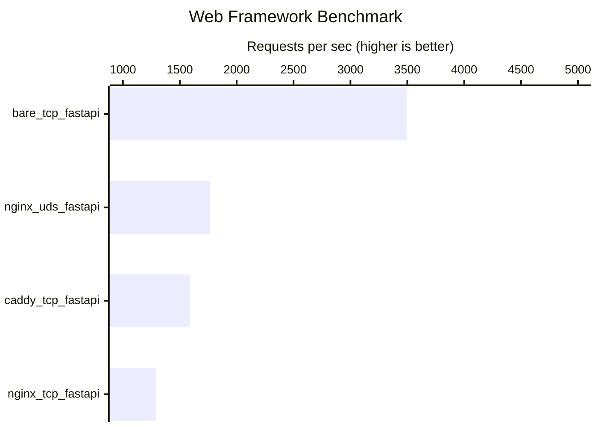

# zenn-web-framework-comparison

```mermaid
xychart-beta horizontal
    title "Web Framework Benchmark"
    x-axis [bare_tcp_fastapi, nginx_uds_fastapi, caddy_tcp_fastapi, nginx_tcp_fastapi]
    y-axis "Requests per sec (higher is better)" 1000 --> 5000
    bar [3494, 1768, 1589, 1291]
```

